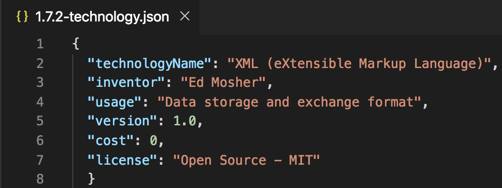
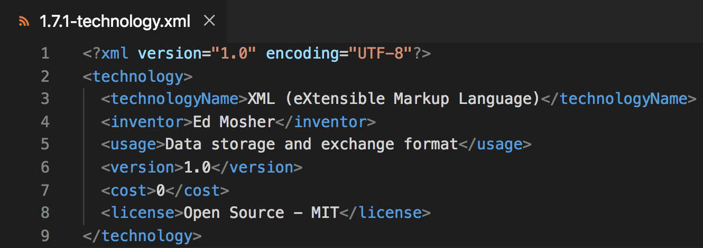
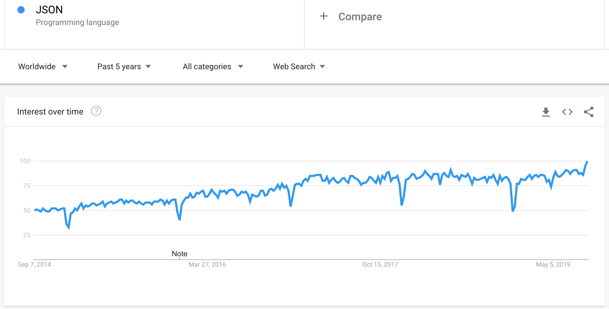
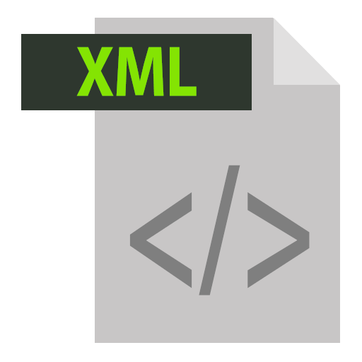
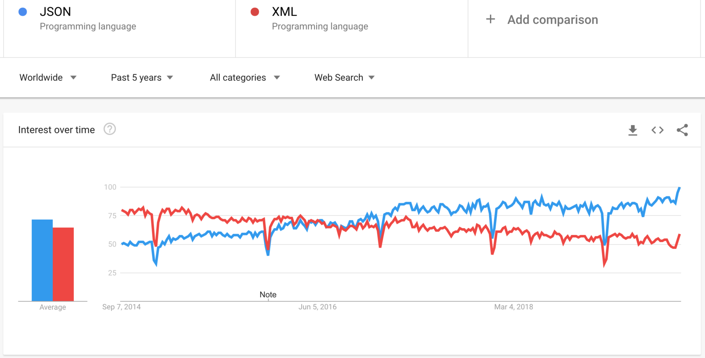

<p align="center">
 
</p>

<p align="center">
 
</p>

JSON JavaScript Object Notation
=====================

Welcome
---------------------

About the Course/Tutorial
---------------------
Hi All, I'm **`Dinanath Jayaswal, Senior UI/Web Developer and Adobe Certified Expert Professional`**, I wanna welcome you to `JSON (JavaScript Object Notation) Crash Course for Beginners`. This course/tutorial will give you a complete understanding of JSON syntax, data types, and formatting.

This course will share the under the hood basic understanding of JSON using the practical implementation in your web development project. Here we will start from scratch/basics & go to a higher level very quickly.


Who is this for? 
---------------------
This course is for anyone interested in quickly learning JSON & it's power to utilize it in Web Development. 

This Course/Tutorial is ideal for:
- Anyone who wants to learn JSON from scratch
- Anyone interested in learning JSON & JSON Schema
- Programmers and Developers at any level
- Web developers
- Application developers
- Anyone who wants to interchange data between clients and servers
- Anyone who wants to choose JSON as the data interchange format in their REST API design

This course/Tutorial is for anyone and everyone, Almost everyone!

Why learn JSON
---------------------
JSON stands for JavaScript Object Notation is text-based and human-readable. JSON has become a widely accepted and popular format for data due to its platform-neutral nature, lightweight format, and it’s the ability to convert directly to native JavaScript Objects. JSON is being used everywhere from Web APIs to NoSQL databases, to server-side language libraries and client-side frameworks.

JSON has significantly improved server-to-browser communications, especially when it comes to AJAX. JSON is better than XML (eXtensible Markup Language) and more popular! Easily exchange data between client and server applications. JSON is easy to use and built for storing and exchanging data.


Course/Tutorial achievement
---------------------

Course/Tutorial Goal
---------------------
After completing/attending this JSON Course/Tutorial, participants should be able to: 
- Understand what and why JSON
- Use JSON format confidently
- Exchange Data with JSON format and use JSON in Web development/project

Prerequisites for current course / What you need to know
---------------------
- Basic knowledge and understandings of HTML, CSS, JavaScript and ASP/PHP
- Knowledge of using any text editor and a web browser
- Basics of Browser and Internet
- A basic understanding of Client Side vs Server Side

Before starting with JSON it is advisable to view and go through following course/tutorials to get knowledge of: 
- **Web Design Development Technology Fundamentals** - [Web Design Development Technology Fundamentals
](https://github.com/dinanathsj29/web-design-development-fundamentals-tutorial),
  - **HTML5** - [HTML5 Essentials Tutorial](https://github.com/dinanathsj29/html5-essentials-tutorial),
    - CSS3 - [CSS3 Fundamentals Tutorial](https://github.com/dinanathsj29/css3-fundamentals-tutorial),
      - **JavaScript** [JavaScript tutorial for Beginners](https://github.com/dinanathsj29/javascript-beginners-tutorial)

Topics included/covered
=====================

1. [Introduction to JSON](#1-introduction-to-json)
    - 1.1. [What is JSON?](#11-what-is-json)
    - 1.2. [Why use JSON?](#12-why-use-json)
    - 1.3. [What JSON is not?](#13-what-json-is-not)
    - 1.4. [Usage of JSON](#14-usage-of-json)
    - 1.5. [Characterstics of JSON](#15-characterstics-of-json)
    - 1.6. [JSON Syntax](#16-json-syntax)
    - 1.7. [JSON vs XML](#17-json-vs-xml)
    - 1.8. [JSON vs XML Trends](#18-json-vs-xml-trends)
    - 1.9. [JSON Data Types](#19-json-data-types)
    - 1.10. [Access-Modify JSON object data](#110-access-modify-json-object-data)
    - 1.11. [JSON Parse](#111-json-parse)
    - 1.12. [JSON Stringify](#112-json-stringify)
    - 1.13. [JSON Arrays](#113-json-arrays)
    - 1.14. [Nested JSON Objects](#114-nested-json-objects)
    - 1.15. [Looping through JSON Array-Objects](#115-looping-through-json-array-objects)
    - 1.16. [Marshalling and Unmarshalling](#116-marshalling-and-unmarshalling)

2. [JSON with jQuery](#2-json-with-jquery)

3. [JSON Resources](#3-json-resources)

1 Introduction to JSON
=====================

1.1. What is JSON?
--------------------- 

<p>
  <figure>
    
 </figure>
</p>

- JSON stands for `JavaScript Object Notation`
- JSON is a syntax for storing and exchanging data
- JSON is a lightweight data-interchange, Data representation format
- JSON is `self-describing`, an easier to understand, easy to use and alternative format to `XML (eXtensible Markup Language)` also widely used these days
- JSON is often used with `AJAX (Asynchronous JavaScript and XML)`
- JSON is language independent (JSON uses JavaScript syntax, with text-only format, Text can be read and used as a data format by most/any modern programming language)
- JSON is commonly used for APIs and Configurations

```
- The JSON format was specified and popularized by `Douglas Crockford`
- The filename extension is `.json`
- JSON internet Media type is `application/json`
```

JSON is a pretty simple data exchange format which helps to communicate between JavaScript and server-side technologies like CGI (Common Gateway Interface), PERL, ASP (Active Server Pages), Java, JSP (Java Server Pages), PHP(HyperText PreProcessor / Personal Home Page), .NET, Cold Fusion CFML, NodeJS, Servelets, WCF (Windows Communication Foundation) and more

JSON has significantly improved server-to-browser communications, especially when it comes to AJAX. Most of today's APIs return the response in JSON format as it is much easier to load, read and process JSON compared to XML, making it very popular.

JSON uses, follows and based on Object Literal Notation syntax of JavaScript. JSON friendly Data Structures and friendly conventions play well with other different languages and platforms

> Example: Company X provides `JSON REST API { }` for the products related data, this WEB API is written with ASP.NET. User/Client Y or Z can make the call to this API by Java or jQuery or any other language to get JSON response.

1.2. Why use JSON?
---------------------

Other than JSON, XML (eXtensible Markup Language) use to be the only option/alternative for open data interchange.

- JSON is text-based and human-readable, easily exchange data between client and server applications
- it's a lightweight data-interchange format that is quickly becoming the default format for data exchange on the internet today!
- JSON is better than XML and more popular!
- JSON is easy to use and built for storing and exchanging data
- Since the JSON format is text only, it can easily be sent to and from a server and used as a data format by any programming language

JSON has become a widely accepted and popular format for data due to its platform-neutral nature, lightweight format, and it’s the ability to convert directly to native JavaScript Objects. JSON is being used everywhere from Web APIs to NoSQL databases, to server-side language libraries and client-side frameworks.

JSON has significantly improved server-to-browser communications, especially when it comes to AJAX. JSON is better than XML and more popular! Easily exchange data between client and server applications. JSON is easy to use and built for storing and exchanging data.

JSON is extremely popular in web applications because it's lightweight, designed to be a language of independent and easy to read and write transfer data easily between server and client.

1.3. What JSON is not?
---------------------

- JSON is not a Programming/Markup language
- JSON is not dependent on JavaScript language
- Many people treat JSON as a javascript object, but it is not! JSON is just string representation inspired from JavaScript Object structure

```
JSON is programming language independent Data Interchange Format - an only text-based easy to use and understand the format used to Import and Export data between different platforms
```

1.4. Usage of JSON
---------------------

- It is used while writing JavaScript-based applications that include browser extensions and websites
- The JSON format is used for serializing and transmitting structured data over a network connection
- It is primarily used to transmit data between a server and web applications (client and server)
- Web services and APIs use JSON format to provide public data
- It can be used with different platform-independent modern programming languages 
- JSON is used in Web APIs as well as NoSQL databases

1.5. Characteristics of JSON
---------------------

- JSON is pretty easy to read, write and understand
- JSON is a lightweight text-based interchange format
- JSON is language independent
- JSON uses, follows and based on Object Literal Notation syntax of JavaScript
- JSON is widely used to exchange, send and receive data from server to client and vice versa
- JSON represent data in the pair of Curley braces and in the form of key-value pairs ie. property and data/value ie. attribute and data/value e.g. ` var Employee = { "employeeName": "Dinanath", "employeeId": "101", "empId": 101} `
- Transfer data easily between Server and Client

1.6. JSON Syntax
---------------------

- JSON syntax is very simple and uses `name : value pair` or `key : value pair`

The JSON syntax is a subset of the JavaScript syntax. JSON syntax is derived from JavaScript object notation syntax:
- Data is in name/value pairs
- Data is separated by commas
- Curly braces hold objects
- Square brackets hold arrays

JSON format starts with `curley brace/bracket {` and `ends with curley brace/bracket }`. In-between curley brace we can put `"name" and value` or `"key":value` or `"property":value/data` pair, every property of the object is separated by comma. 

JSON represents data in the `pair of curly braces and in the form of key-value pairs ie property and data`. We can separate `Property Name` with the help of `colon:` then specify `property Value` and multiple properties are separated with `comma,`.

```

- JSON, keys must be strings, written with "double quotes", JavaScript names don't.

```

To access or read data from a JSON object, we simply need to use property name with `. dot notation`, will get all IntelliSense as soon as will use any `jsonObjectName.propertyName` i.e. `JsonObjectName.propertyName` or so.

As soon as we assign JSON format/values to any JavaScript variable, it becomes a JavaScript object to which we can access via `. dot notation`.

### 1.6.1. JSON Values
In JSON, values must be one of the following data types:

- a string
- a number
- an object (JSON object)
- an array
- a boolean
- null

> **Syntax & Example**: `1.6.1-employee.json`

```json
{ 
  "employeeName": "Dinanath",
  "employeeId": 100,
  "department": "IT-Development",
  "role": "Sr. UI Developer",
  "salary": 100000
}
```

<hr/>

> **Syntax & Example**: `1.6.2-technology.json`

```json
{
  "technologyName": "JSON (JavaScript Object Notation)",
  "inventor": "Douglas Crockford",
  "usage": "Data storage and exchange format",
  "version": 1.0,
  "cost": 0,
  "license": "Open Source - MIT"
}
```

<hr/>

> **Syntax & Example**: `1.6.3-person.json`

```json
{ 
  "name": "Dinanath",
  "age": 50,
  "country": "India",
  "height": 5.6,
  "color": "Black-Medium",
  "married": true
}
```

### 1.6.2. JSON Syntax vs JavaScript Object Syntax

The JSON format is almost exactly alike to JavaScript objects.

| JSON Syntax                     | JavaScript Object Syntax              |
| --------------------------------|---------------------------------------|
| JSON `Keys` must be strings, written with double quotes <br/> Example: ```{ "name": "Dinanath" }```   | JavaScript Object `Keys` can be strings, numbers, or identifier names <br/> Example: ```{ name: "Dinanath" }``` |
| JSON, `string` values must be written with double quotes  <br/> Example: ```{ "country": "India" }``` | JavaScript Object, `string` values can be written with double or single quotes  <br/> Example: ```{ country: 'India' }``` |
| JSON Object: <br/> ``` { "name": "Dinanath", "age": 50, "married": true }``` | JavaScript Object: <br/> ``` { name: 'Dinanath', age: 50, married: true }```|


1.7. JSON vs XML
---------------------

### 1.7.1. Difference between JSON and XML

| JSON                            | XML                                   |
| --------------------------------|---------------------------------------|
| <p align="center">  </p> | <p align="center">  </p>|
| JavaScript Object Notation      | eXtensible Markup Language            |
| JSON uses `key : value` or `name : value` pair to store data (JSON doesn't use end tag) | XML uses **tags &lt; value &gt;, element or node** to store data | 
| JSON is shorter, JSON has a more compact style than XML                 | XML is pretty larger/lengthy as we need to open and close tags for every `name` or `key`|
| JSON is `quicker and easier` to read and write | XML is `little difficult to read and write` as we need to write many tags |
| JSON can use arrays             | XML cant use arrays, it uses tags     |
| JSON can be `parsed by a standard JavaScript function`  | XML has to be `parsed with an XML parser` |
| For AJAX applications, JSON is faster and easier than XML | XML is much more difficult to parse than JSON |
| JSON uses less data overall, so reduces the cost and increases the parsing speed | The XML parsing process can take a long time due to verbose nature of xml and its element structure |
| JSON uses a `map data structure`| XML uses a `tree data structure` |
| JSON - JavaScript Object Notation - coding structure and syntax: <p align="center">  </p> | XML - eXtensible Markup Language - coding structure and syntax: <p align="center">   </p> |

### 1.7.2. Similarity between JSON and XML

Both JSON and XML can be used to exchange, send and receive data from a web server

- JSON and XML both are `self-describing (human-readable)`
- JSON and XML both can be parsed and used by various programming languages
- JSON and XML both can store hierarchical data structure (values within values)
- Both JSON and XML can be fetched with JavaScript `XMLHttpRequest` methodology

> **Syntax & Example**: `XML (eXtensible Markup Language) 1.7.1-technology.xml`

```xml
<Technology>
  <technologyName>XML (eXtensible Markup Language)</Technology>
  <inventor>Ed Mosher</inventor>
  <usage>Data storage and exchange format</usage>
  <version>1.0</version>
  <cost>0</cost>
  <license>Open Source - MIT</license>
</Technology>
```

<hr/>

> **Syntax & Example**: `JSON (JavaScript Object Notation) 1.7.2-technology.json`

```json
{
  "technologyName": "XML (eXtensible Markup Language)",
  "inventor": "Ed Mosher",
  "usage": "Data storage and exchange format",
  "version": 1.0,
  "cost": 0,
  "license": "Open Source - MIT",
  }
```


1.8. JSON vs XML Trends
---------------------

### 1.8.1. JSON Trend
- JSON is better than XML and extremely popular now a days!

<p>
 <figure>
 &nbsp;&nbsp;&nbsp; 
 <figcaption>&nbsp;&nbsp;&nbsp; Image - JSON Google Trends</figcaption>
 </figure>
</p>

<hr/>

### 1.8.2. JSON vs XML Trend

<p>
  <figure>
   
    
 </figure>
</p> 

<br/>

<p>
 <figure>
 &nbsp;&nbsp;&nbsp; 
 <figcaption>&nbsp;&nbsp;&nbsp; Image - JSON vs XML Google Trends</figcaption>
 </figure>
</p>

1.9. JSON Data Types
---------------------

Json supports values of the following data types:

| JSON Valid Data Types                     | Data Types Description                |
| ------------------------------------------|---------------------------------------|
| String | Strings in JSON must be written in double quotes <br/> `"Hello",    "Dinanath",   "I/We"` |
| Number | Numbers in JSON can be an integer or a floating point supports all types of numbers - complete number, decimal, negative number, scientific notation number) <br/> `10,   2.5,   -10,    2.5e10` |
| Object | Most complex but widely used Data types  <br/> ` { "key": "value" } { "name": "Dinanath", "id": 101 }` |
| Array | JSON value can be array which holds multiple items of various data types <br/> `[1,2,3,4,5]   ["Dinanath", "Akash", "Ambar", "Sagar", "Suraj"]` |
| Boolean | true or false <br/> ` { "isDone":true }` |
| null | null (nothing/empty value) <br/> `{ "status":null }` |

```
JSON values cannot be of following data types:

- a function
- a date
- undefined
```


1.10. Access-Modify JSON object data
---------------------

JavaScript object or JSON object data can be accessed and modified by two syntax or ways:
- Dot notation syntax 
- Square bracket syntax 

### 1.10.1. Dot notation 
To access, read or modify JSON object data, we simply need to use property name with `. dot notation`, will get all IntelliSense as soon as will use any `jsonObjectName.propertyName` or so.

As soon as we assign JSON format/values to any JavaScript variable, it becomes a JavaScript object to which we can access via `. dot notation`.

> **Syntax**: ```jsonObjectName.propertyName``` or ```TechnologyJSON.technologyName```

### 1.10.2. Square bracket
Second or another way to access, read or modify JSON object data is Square bracket notation

> **Syntax**: ```jsonObjectName.['propertyName']``` or ```TechnologyJSON.['technologyName']```

> **Syntax & Example**: `1.10.1-access-modify-json-data.html`

```html
<!DOCTYPE html>
<html lang="en">

  <head>
    <meta charset="UTF-8">
    <meta name="viewport" content="width=device-width, initial-scale=1.0">
    <meta http-equiv="X-UA-Compatible" content="ie=edge">
    <title>json-access-modify-data</title>

    <script type="text/javascript">

      // creating JSON object
      var TechnologyJSON = {
        "technologyName": "JSON (JavaScript Object Notation)",
        "inventor": "Douglas Crockford",
        "usage": "Data storage and exchange format",
        "version": 1.0,
        "cost": 0,
        "license": "Open Source - MIT"
      }

      // accessing data from a json object
      // JsonObjectName.propertyName

      // Dot notation syntax 
      console.log(TechnologyJSON.inventor);
      document.write('<li>' + TechnologyJSON.inventor + '</li>');
      document.write('<li>' + TechnologyJSON.usage + '</li>');

      // Square bracket syntax 
      console.log(TechnologyJSON['inventor']);
      document.write('<li>' + TechnologyJSON['inventor'] + '</li>');
      document.write('<li>' + TechnologyJSON['license'] + '</li>');

      // modifying data
      var techName1 = TechnologyJSON.technologyName = 'XML';
      console.log(techName1);
      document.write('<br/><br/><li>' + techName1 + '</li>');

      var techName2 = TechnologyJSON['technologyName'] = 'AJAX';
      console.log(techName2);
      document.write('<br/><br/><li>' + techName2 + '</li>');

    </script>

  </head>

  <body>
    
  </body>

</html>
```


1.11. JSON Parse
---------------------

1.11. Converting a JSON string to JSON array/object
---------------------

- `JSON.parse()` method converts a JSON string to JSON array/object
- `JSON.parse()` Parse a string (written in JSON format) and return a JavaScript object
- Usually data receiving from a web server is string, with `JSON.parse()` method one can Parse the data to JavaScript object
- `JSON.parse()` was first added to the `fifth edition of ECMAScript`, which as of `2017` is supported by all major browsers

> **Syntax & Example**: `1.11.1-json-parse.html`

```html
<!DOCTYPE html>
<html lang="en">

  <head>
    <meta charset="UTF-8">
    <meta name="viewport" content="width=device-width, initial-scale=1.0">
    <meta http-equiv="X-UA-Compatible" content="ie=edge">
    <title>json-parse</title>

    <script type="text/javascript">

      // creating string object to hold json like data
      var TechnologyStringObj = '{ "technologyName": "JSON (JavaScript Object Notation)", "inventor": "Douglas Crockford", "usage": "Data storage and exchange format", "version": 1.0, "cost": 0, "license": "Open Source - MIT" }';

      // parse a string object to json
      var TechnologyJSON = JSON.parse(TechnologyStringObj);
      console.log(TechnologyJSON);

      // accessing data from a json object
      // JsonObjectName.propertyName
      console.log(TechnologyJSON.technologyName);
      
    </script>

  </head>

  <body>
    
  </body>

</html>
```


12 JSON Stringify
---------------------

1.12. Converting a JSON object or JSON array into a string
---------------------

- `JSON.stringify()` method converts a JSON object or JSON array into a string
- `JSON.stringify()` method converts a JavaScript object or value to a JSON string
- When sending data to a web server the data has to be a string

> **Syntax & Example**: `1.12.1-json-stringify.html`

```html
<!DOCTYPE html>
<html lang="en">

  <head>
    <meta charset="UTF-8">
    <meta name="viewport" content="width=device-width, initial-scale=1.0">
    <meta http-equiv="X-UA-Compatible" content="ie=edge">
    <title>json-stringify</title>

    <script type="text/javascript">

      // json object
      var TechnologyJSON = { "technologyName": "JSON (JavaScript Object Notation)", "inventor": "Douglas Crockford", "usage": "Data storage and exchange format", "version": 1.0, "cost": 0, "license": "Open Source - MIT" };

      console.log(TechnologyJSON);
      console.log(TechnologyJSON.technologyName);

      // by default json object are not printed in html view - it shows `[object Object]`
      document.write('initial TechnologyJSON object:', TechnologyJSON);

      // parse a json object to string
      var TechnologyJSONStringify = JSON.stringify(TechnologyJSON);

      // once json object converted to string - it can be available/placed for view
      document.write('<br/> <br/> <strong>JSON.stringify</strong> :', TechnologyJSONStringify);

      console.log('JSON.stringify TechnologyJSONStringify: ', TechnologyJSONStringify);
      console.log(TechnologyJSONStringify.technologyName); //undefined

      // parse a string object to json
      var TechnologyJSONObj = JSON.parse(TechnologyJSONStringify);
      console.log(TechnologyJSONObj);
      console.log(TechnologyJSONObj.technologyName);
      
    </script>

  </head>

  <body>
    
  </body>

</html>
```

1.13. JSON Arrays
---------------------

- We can store more than one record or more than on technology, employee or required data in the JSON object, this is when JSON arrays can be used
- Arrays in JSON are as same as JavaScript arrays
- `A JSON array can contain multiple objects in [ square bracket separated with comma, ]`

### To create a JSON array:
1. Wrap the objects in `[ square brackets ]`
2. Each object must be seperated with a comma `{ },`
3. `Object = [ { }, { }, { }, { } ]`

> **Syntax & Example**: `1.13.1-json-array.html`

```html
<!DOCTYPE html>
<html lang="en">

  <head>
    <meta charset="UTF-8">
    <meta name="viewport" content="width=device-width, initial-scale=1.0">
    <meta http-equiv="X-UA-Compatible" content="ie=edge">
    <title>json-array</title>

    <script type="text/javascript">

      // creating JSON object
      var TechnologiesJSONArray = [
        {
          "technologyName": "JSON (JavaScript Object Notation)",
          "usage": "Data storage and exchange format",
          "version": 1.0,
          "cost": 0.00
        },
        
        {
          "technologyName": "HTML (HyperText Markup Language)",
          "usage": "To create a web page pages/web sites/web apps",
          "version": 5.0,
          "cost": 0.00
        }
      ];

      console.log(TechnologiesJSONArray);

      // accessing data from a json object
      // jsonObject[arrayPosition/ indexPosition].propertyName;
      console.log(TechnologiesJSONArray[0].version); // 1.0
      console.log(TechnologiesJSONArray[1].version); // 5.0

      document.write('<li> <strong>Technology Name:</strong> ' + TechnologiesJSONArray[0].technologyName + ' || <strong>Version is:</strong> ' + TechnologiesJSONArray[0].version + '</li>');
      document.write('<li> <strong>Technology Name:</strong> ' + TechnologiesJSONArray[1].technologyName + ' || <strong>Version is:</strong> ' + TechnologiesJSONArray[1].version + '</li>');

    </script>

  </head>

  <body>
    
  </body>

</html>
```

1.14. Nested JSON Objects
---------------------

1.14. JSON Objects
---------------------

- We know that JSON objects are surrounded by curly braces `{ }`
- As per logic and requirements we can store multiple objects inside a main JSON object
- `Object = {   { }, { }, { }, { }   }`

> **Syntax & Example**: `1.14.1-json-nested-objects.html`

```html
<!DOCTYPE html>
<html lang="en">

  <head>
    <meta charset="UTF-8">
    <meta name="viewport" content="width=device-width, initial-scale=1.0">
    <meta http-equiv="X-UA-Compatible" content="ie=edge">
    <title>json-nested-objectes</title>

    <script type="text/javascript">

      // creating JSON object
      var TechnologyJSONObject = {
        "Json": {
          "technologyName": "JSON (JavaScript Object Notation)",
          "usage": "Data storage and exchange format",
          "version": 1.0,
          "cost": 0.00
        },

        "Html": {
          "technologyName": "HTML (HyperText Markup Language)",
          "usage": "To create a web page pages/web sites/web apps",
          "version": 5.0,
          "cost": 0.00
        },
      };

      console.log(TechnologyJSONObject);

      // accessing data from a json object 
      // jsonMainObject.jsonSubObjectName.propertyName;
      console.log(TechnologyJSONObject.Json.version); // 1.0
      console.log(TechnologyJSONObject.Html.version); // 5.0

      // square bracket syntax
      console.log(TechnologyJSONObject.Json["version"]); // 1.0
      console.log(TechnologyJSONObject.Html["version"]); // 5.0

      document.write('<li> <strong>Technology Name:</strong> ' + TechnologyJSONObject.Json.technologyName + ' || <strong>Version is:</strong> ' + TechnologyJSONObject.Json.version + '</li>');
      document.write('<li> <strong>Technology Name:</strong> ' + TechnologyJSONObject.Html.technologyName + ' || <strong>Version is:</strong> ' + TechnologyJSONObject.Html.version + '</li>');

    </script>

  </head>

  <body>
    
  </body>

</html>
```

1.15. Looping through JSON Array-Objects
---------------------

### 1.15.1. Looping Through an Array
- One can access JSON array values by using a `for` or `for-in` loop:

> **Syntax & Example**: `1.15.1-looping-json-array.html`

```html
<!DOCTYPE html>
<html lang="en">

  <head>
    <meta charset="UTF-8">
    <meta name="viewport" content="width=device-width, initial-scale=1.0">
    <meta http-equiv="X-UA-Compatible" content="ie=edge">
    <title>looping-json-array</title>

    <script type="text/javascript">

      // creating JSON object
      var TechnologyJSON = {
          "technologyName": "JSON (JavaScript Object Notation)",
          "usage": "Data storage and exchange format",
          "version": 1.0,
          "cost": 0.00,
          "keywords":['json','JavaScript','Object','Notation','key','value','key value pair']
      };

      console.log(TechnologyJSON);

      // accessing data from a json object 
      // jsonMainObject.jsonSubObjectName.propertyName;
      console.log(TechnologyJSON.keywords);
      console.log(TechnologyJSON.keywords[0]);

      // 1. for loop
      let keywordsLength = TechnologyJSON.keywords.length;

      document.write('<h1> Technology keyword - For loop </h1>');
      for(let keyword=0; keyword < keywordsLength; keyword++) {
        document.write('<li>' + TechnologyJSON.keywords[keyword] + '</li>');
      }

      // 2. for in loop
      document.write('----------------------------------------------------');
      document.write('<h1> Technology keyword  - For in loop </h1>');

      let keywords = TechnologyJSON.keywords;
      for(let kw in keywords) {
        document.write('<li>' + TechnologyJSON.keywords[kw] + '</li>');
      }

    </script>

  </head>

  <body>
    
  </body>

</html>
```

<hr/>

### 1.15.2. Looping Through an Object

> **Syntax & Example**: `1.15.2-looping-json-object.html`

```html
<!DOCTYPE html>
<html lang="en">

  <head>
    <meta charset="UTF-8">
    <meta name="viewport" content="width=device-width, initial-scale=1.0">
    <meta http-equiv="X-UA-Compatible" content="ie=edge">
    <title>looping-json-object</title>

    <script type="text/javascript">

      // creating JSON object
      var TechnologyJSON = {
          "technologyName": "JSON (JavaScript Object Notation)",
          "usage": "Data storage and exchange format",
          "version": 1.0,
          "cost": 0.00,
          "keywords":['json','JavaScript','Object','Notation','key','value','key value pair'],

          "Html": {
            "technologyName": "HTML (HyperText Markup Language)",
            "usage": "To create a web page pages/web sites/web apps",
            "version": 5.0,
            "cost": 0.00
          },
      };

      console.log(TechnologyJSON);

      // accessing data from a json object 
      // jsonMainObject.jsonSubObjectName.propertyName;
      console.log(TechnologyJSON.keywords);
      console.log(TechnologyJSON.keywords[0]);
      console.log(TechnologyJSON.Html);
      console.log('----------------------------------------------------');

      // for in loop
      // document.write('----------------------------------------------------');
      document.write('<h1> JSON Object keys </h1>');

      for(let _key in TechnologyJSON) {
        document.write('<li>' + _key + '</li>');
      }

      // document.write('----------------------------------------------------');
      document.write('<h1> JSON Object keys and Values</h1>');

      for(let _key in TechnologyJSON) {
        document.write('<li>' + _key + ' : ' + TechnologyJSON[_key] + '</li>');
      }

      // document.write('----------------------------------------------------');
      document.write('<h1> JSON Object - Inner objects keys and Values</h1>');

      for(let _key in TechnologyJSON.Html) {
        document.write('<li>' + _key + ' : ' + TechnologyJSON.Html[_key] + '</li>');
      }

    </script>

  </head>

  <body>
    
  </body>

</html>
```

<hr/> 

> **Syntax & Example**: `1.15.3-looping-json-array.html`

```html
<!DOCTYPE html>
<html lang="en">

  <head>
    <meta charset="UTF-8">
    <meta name="viewport" content="width=device-width, initial-scale=1.0">
    <meta http-equiv="X-UA-Compatible" content="ie=edge">
    <title>looping-json-array</title>

    <script type="text/javascript">

      // creating JSON object
      var ColorsJSON = {
        "colors": ["Cyan", "Magenta", "Yellow", "Black", "Red", "Green", "Blue"],
        "colorDetails": [
          { "colorName": "Red", "colorHexCode": "#ff0000" },
          { "colorName": "Green", "colorHexCode": "#00ff00" },
          { "colorName": "Blue", "colorHexCode": "#0000ff" },
        ]
      };

      console.log(ColorsJSON);

      // accessing data from a json object 
      // jsonMainObject.jsonSubObjectName.propertyName;
      console.log(ColorsJSON.colors);
      console.log(ColorsJSON.colors[0]);
      console.log('----------------------------------------------------');

      // for loop
      document.write('<h1> Color Index & Color values - For loop </h1>');
      let totalColors = ColorsJSON.colors.length;
      for (let colorIndex = 0; colorIndex < totalColors; colorIndex++) {
        document.write('<li>' + colorIndex + " : " + ColorsJSON.colors[colorIndex] + '</li>');
      }

      // for in loop
      document.write('----------------------------------------------------');
      document.write('<h1> Color Index & Color values - For in loop </h1>');

      for(let _key in ColorsJSON.colors) {
        document.write('<li>' + ColorsJSON.colors[_key] + '</li>');
      }

      document.write('----------------------------------------------------');
      document.write('<h1> Inner Color Index & Color values - For in loop </h1>');

      for (let mainKey in ColorsJSON.colorDetails) {
        
        for(let innerKey in ColorsJSON.colorDetails[mainKey]) {

          document.write('<li>' + ColorsJSON.colorDetails[mainKey][innerKey] + '</li>');

        }

      }

    </script>

  </head>

  <body>

  </body>

</html>
```


1.16. Marshalling and Unmarshalling
---------------------

### 1.16.1. Marshalling
- Creating JSON data/object from custom objects
- Converting your custom object to a representation accepted by the client in the form of JSON 
- ( Object --> JSON )

### 1.16.2. Unmarshalling
- The opposite of marshalling is unmarshalling - the creation of custom objects from XML, JSON and the like
- ( JSON --> Object )


2 JSON with jQuery
=====================  
- jQuery is a lightweight, `"write less, do more"`, JavaScript library
- jQuery is a fast, small, feature-rich and easy to learn JavaScript library
- It makes things like `HTML document traversal and manipulation, event handling, animation, and Ajax much simpler with an easy-to-use API that works across a multitude of browsers`
- With a combination of versatility and extensibility, jQuery has changed the way that millions of people write JavaScript
- `jQuery is just a JavaScript library` - jQuery greatly simplifies JavaScript programming
- All the power of jQuery is accessed via JavaScript, so having a strong grasp of JavaScript is essential for understanding, structuring, and debugging your code

We can download the jQuery library script files from jQuery official website `https://jquery.com/download/` or use CDN (Content Delivery Network / Content Distribution Network) links like `https://cdnjs.com/libraries/jquery/` or `https://developers.google.com/speed/libraries/`

### 2.1. jQuery JSON basics

> **Syntax & Example**: `2.json-with-jquery/2.1-jquery-json-basic.html`

```html
<!DOCTYPE html>
<html lang="en">

  <head>
    <meta charset="UTF-8">
    <meta name="viewport" content="width=device-width, initial-scale=1.0">
    <meta http-equiv="X-UA-Compatible" content="ie=edge">
    <title>jQuery-json-basics</title>

    <script src="./_library/jquery-3.4.1.min.js"></script>
    <script type="text/javascript">

      $(document).ready(function() {
        // creating JSON object
        var Technology = {
          "technologyName": "JSON (JavaScript Object Notation)",
          "usage": "Data storage and exchange format",
          "version": 1.0,
          "cost": 0.00
        }

        // accessing data from a json object
        // JsonObjectName.propertyName
        console.log(Technology.technologyName); // JSON (JavaScript Object Notation)

        var resultText = '';
        resultText += 'Technology Name = ' + Technology.technologyName + '<br/>';
        resultText += 'Usage = ' + Technology.usage + '<br/>';
        resultText += 'Version = ' + Technology.version + '<br/>';
        resultText += 'Cost = ' + Technology.cost + '<br/>';

        // assign data to html element
        $('#textContainerDiv').html(resultText);

      });
    </script>

  </head>

  <body>

    <div id="textContainerDiv"></div>
    
  </body>

</html>
```

<hr/> 

### 2.2. jQuery JSON Arrays

> **Syntax & Example**: `2.json-with-jquery/2.2-jquery-json-array.html`

```html
<!DOCTYPE html>
<html lang="en">

  <head>
    <meta charset="UTF-8">
    <meta name="viewport" content="width=device-width, initial-scale=1.0">
    <meta http-equiv="X-UA-Compatible" content="ie=edge">
    <title>jQuery-json-array</title>

    <script src="./_library/jquery-3.4.1.min.js"></script>
    <script type="text/javascript">

      $(document).ready(function() {
        // creating JSON object
        var TechnologiesJSONArray = [
          {
            "technologyName": "JSON (JavaScript Object Notation)",
            "usage": "Data storage and exchange format",
            "version": 1.0,
            "cost": 0.00
          },
          
          {
            "technologyName": "HTML (HyperText Markup Language)",
            "usage": "To create a web page pages/web sites/web apps",
            "version": 5.0,
            "cost": 0.00
          }
        ];

        // accessing data from a json object
        // jsonObject[arrayPosition/ indexPosition].propertyName;
        console.log(TechnologiesJSONArray[0].version); // 1.0
        console.log(TechnologiesJSONArray[1].version); // 5.0

        var technologyNameText = TechnologiesJSONArray[0].technologyName + '<br>' ;
        technologyNameText += TechnologiesJSONArray[1].technologyName;

        // assign data to html element
        $('#textContainerDiv').html(technologyNameText);

      });
    </script>

  </head>

  <body>

    <div id="textContainerDiv"></div>
    
  </body>

</html>
```

<hr/> 


### 2.3. jQuery nested JSON Objects

> **Syntax & Example**: `2.json-with-jquery/2.3-jquery-json-nested-object.html`

```html
<!DOCTYPE html>
<html lang="en">

  <head>
    <meta charset="UTF-8">
    <meta name="viewport" content="width=device-width, initial-scale=1.0">
    <meta http-equiv="X-UA-Compatible" content="ie=edge">
    <title>jQuery-json-nested-objectes</title>

    <script src="./_library/jquery-3.4.1.min.js"></script>
    <script type="text/javascript">

      $(document).ready(function() {
        // creating JSON object
        var TechnologyJSONObject = {
          "Json": {
            "technologyName": "JSON (JavaScript Object Notation)",
            "usage": "Data storage and exchange format",
            "version": 1.0,
            "cost": 0.00
          },

          "Html": {
            "technologyName": "HTML (HyperText Markup Language)",
            "usage": "To create a web page pages/web sites/web apps",
            "version": 5.0,
            "cost": 0.00
          },
        };

        // accessing data from a json object 
        // jsonMainObject.jsonSubObjectName.propertyName;
        console.log(TechnologyJSONObject.Json.version); // 1.0
        console.log(TechnologyJSONObject.Html.version); // 5.0

        // square bracket syntax
        console.log(TechnologyJSONObject.Json["version"]); // 1.0
        console.log(TechnologyJSONObject.Html["version"]); // 5.0

        var technologyNameText = TechnologyJSONObject.Json.technologyName + '<br>' ;
       technologyNameText += TechnologyJSONObject.Html.technologyName;

        // assign data to html element
        $('#textContainerDiv').html(technologyNameText);

      });
    </script>

  </head>

  <body>

    <div id="textContainerDiv"></div>
    
  </body>

</html>
```

3 JSON Resources
=====================  

> ### JSON Editor Online - view, edit and format JSON online
- https://jsoneditoronline.org

> ### JSON Formatter & Validator
- https://jsonformatter.curiousconcept.com
- https://jsonlint.com/
- https://zaa.ch/jsonlint/

> ### Online free JSON data store
- Create and use a simple JSON data store for your web or mobile app: http://myjson.com

> ### Fake Online REST API for Testing and Prototyping
- JSONPlaceholder: https://jsonplaceholder.typicode.com/

> ### xml validator
- https://www.xmlvalidation.com/
- https://www.w3schools.com/xml/xml_validator.asp
